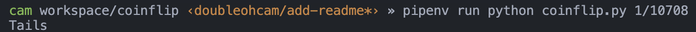
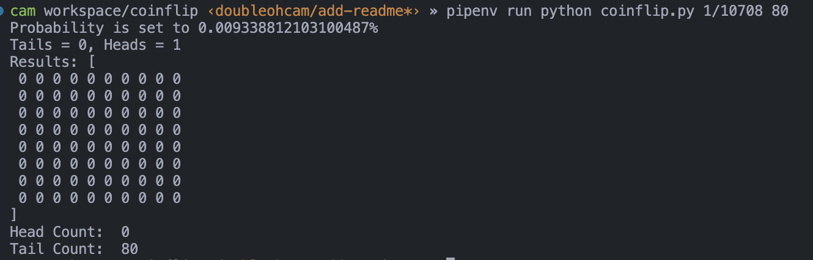

# coinflip

> You've got to ask yourself one question: 'Do I feel lucky?'

This small project originated from my fear of flying. According to [oddsofdying](https://oddsofdying.com/plane/), there is a 1 in 10,708 chance that my next flight will be my last, which is quite low! However, as a dumb human, I have a hard time conceptualizing how small of a chance that actually is.

To solve for this, `coinflip` aims to give dumb humans like myself an immediate result. The premise: given a weighted coin such that `Heads` has `$probability` chance of happening, flip the coin and record the result.

## Usage

To figure out if I'll survive my next plane ride, let's flip the weighted coin. If it lands on `Heads`, I die. If `Tails`, I survive to live another day. Let's use the `1/10,780` number from earlier as the probability:

Alright, so far so good. But now I want to know if my luck will keep going. Let's say that I fly four roundtrips in a year on direct flights, and I will probably keep that pace for the next ten years. That's `(4 * 2) * 10 = 80` flights. Let's flip 80 weighted coins and see if I will die in any of these flights:

I survived! Ah, I feel much better and now will never be afraid of flying ever again... :smile:

### Inputs

There are two inputs, one required and one optional.

`probability`: Can take the form of a float (`0.0123`) or a fraction `1/123`
`(optional) number_of_flips`: A whole number. Defaults to `1` if not present.

### Outputs

If `number_of_flips == 1`, the program will output the string result of a single coinflip, ie. `Heads` or `Tails`.

If `number_of_flips > 1`, the program will output the array of results as well as a total count of occurances.

## Setup

To setup local dev, run `script/bootstrap`
